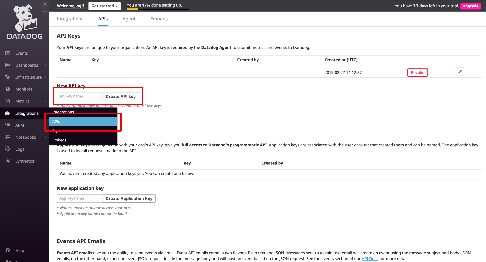
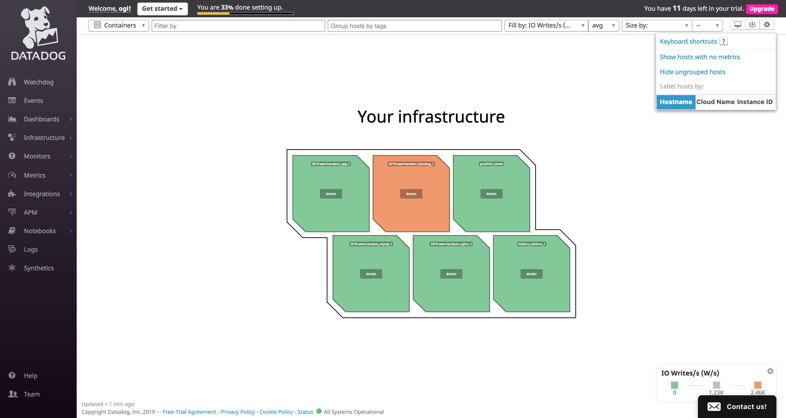

## 概要
Datadogはサーバー上だけではなく、ローカルでも動かすことができます。  
単純なメトリクスだけでなくでAPMも動かすことができるので、開発環境でもDatadogを役立てていきましょう

## docker-composeで動かす準備
まず、 `docker-compose.yaml` で定義されているdatadogを起動します。  
Datadogを動かすための定義がコメントアウトされているので、コメントアウトを外してdocker-composeで動かす準備をします。

```diff
-  # datadog:
-  #   image: datadog/agent:latest
-  #   environment:
-  #     - DD_API_KEY=${DD_API_KEY}
-  #     - DD_TAGS=env:${USER}
-  #     - DD_APM_ENABLED=true
-  #   volumes:
-  #     - /var/run/docker.sock:/var/run/docker.sock:ro
-  #     - /proc/:/host/proc:ro
-  #     - /sys/fs/cgroup:/host/sys/fs/cgroup:ro
-  #   #XXX: Datadogのログ出力が多すぎるため、ログを破棄
-  #   logging:
-  #     driver: 'none'
+    datadog:
+      image: datadog/agent:latest
+      environment:
+        - DD_API_KEY=${DD_API_KEY}
+        - DD_TAGS=env:${USER}
+        - DD_APM_ENABLED=true
+      volumes:
+        - /var/run/docker.sock:/var/run/docker.sock:ro
+        - /proc/:/host/proc:ro
+        - /sys/fs/cgroup:/host/sys/fs/cgroup:ro
+      #XXX: Datadogのログ出力が多すぎるため、ログを破棄
+      logging:
+        driver: 'none'
```

!!! note "環境変数の受け渡し"
    `DD_API_KEY=${DD_API_KEY}` のように記述することで、ホストマシンの環境変数(右側)をコンテナへ展開することが可能です。  
    ここでは秘匿情報である `DD_API_KEY` と、どのマシンでdatadogが動いているか確認するために `USER` をコンテナ上へ展開します。

## DatadogのAPIキーを取得
まずはDatadogへログインし、APIキーを取得しましょう。  

[https://app.datadoghq.com/account/settings#api](https://app.datadoghq.com/account/settings#api)


取得したAPIキーはdocker-composeから参照できるようローカルの環境変数へ展開します。

```
$ export DD_API_KEY=6d6xxxxxxxxxxxxxxxxxxxx
```

## docker-composeの起動
ホストマシンへ `DD_API_KEY` の環境変数を展開したあとはdocker-composeを立ち上げるだけです。  

```
$ docker-compose up
```

[http://localhost:8001/](http://localhost:8001/) へアクセスし、起動しているか確認しましょう。

## datadogで確認
今回立ち上げたdatadogはホストマシンで立ち上げているDockerコンテナと、LaravelのAPMを有効化しています。  
Datadog上でそれぞれのダッシュボードを見てみましょうコンテナの起

### 起動しているコンテナの確認
起動されているDockerコンテナを一覧でみることができます。

[https://app.datadoghq.com/infrastructure/map?node_type=container](https://app.datadoghq.com/infrastructure/map?node_type=container)



### APMの確認
APMを使うことでローカルでもスロークエリの発見や分散トレースを試すことが可能です。  

[https://app.datadoghq.com/apm/services](https://app.datadoghq.com/apm/services)


