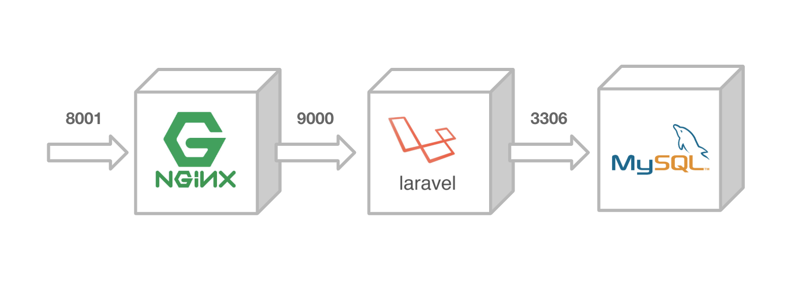
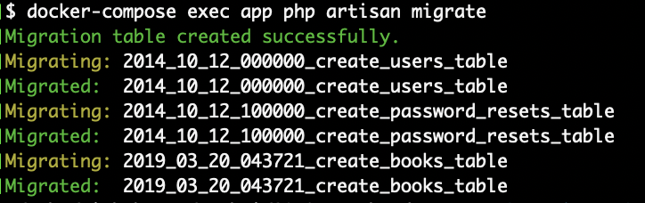

## 概要


ECSの前に、まずはローカルでdocker-composeを用いてLaravelを動かしてみましょう

## docker-compose up
ハンズオンのディレクトリへ移動してdocker-composeで起動してみましょう。  

```console
$ git clone https://github.com/y-ohgi/2019-aws-handson
$ cd 2019-aws-handson/laravel
$ docker-compose up
```

Laravelのウェルカムページが表示されれば成功です！


## MySQLを使用する
LaravelとMySQLを接続します。

### migrateの実行
起動しているdocker-composeをそのままに、別のターミナルを開いて操作します。

まずはmigrateの実行を行います。  
既に起動しているDockerコンテナの中で `php` コマンドを打ってmigrateを行います。

```console
$ docker-compose exec app php artisan migrate
```



## APIの動作確認
まずは `/api/books` のパスにアクセスして、何も帰ってこないことを確認します。  

```console
$ curl localhost:8001/api/books
[]
```

何回かPOSTリクエストを送って、データを増やしてみます。  
```console
$ curl -X POST localhost:8001/api/books
{
  "title": "tmp title",
  "updated_at": "2019-05-14 10:35:39",
  "created_at": "2019-05-14 10:35:39",
  "id": 1
}
$ curl -X POST localhost:8001/api/books
{
  "title": "tmp title",
  "updated_at": "2019-05-14 10:35:39",
  "created_at": "2019-05-14 10:35:39",
  "id": 2
}
```

最後に `/api/books` へGETリクエストを送り、MySQLへデータが格納されていることを確認します。

```console
$ curl localhost:8001/api/books
[
  {
    "id": 1,
    "title": "tmp title",
    "created_at": "2019-05-14 10:35:34",
    "updated_at": "2019-05-14 10:35:34"
  },
  {
    "id": 2,
    "title": "tmp title",
    "created_at": "2019-05-14 10:35:39",
    "updated_at": "2019-05-14 10:35:39"
  }
]
```

## MySQLの中に入ってみる
Dockerコンテナ上で動かしているMySQLへログインしてみます。  

```console
$ docker-compose exec mysql mysql
Your MySQL connection id is 8
Server version: 5.7.25 MySQL Community Server (GPL)

Copyright (c) 2000, 2019, Oracle and/or its affiliates. All rights reserved.

Oracle is a registered trademark of Oracle Corporation and/or its
affiliates. Other names may be trademarks of their respective
owners.

Type 'help;' or '\h' for help. Type '\c' to clear the current input statement.

mysql>
```

MySQLの公式Docker Image はデフォルトで `mysql` というデータベースが作成されます。今回は特に何も設定せず、デフォルトの `mysql` データベースを使用しています。  
MySQLコンテナの中に入り、 `mysql` データベースのテーブルを一覧してみましょう。

```console
mysql> use mysql
Reading table information for completion of table and column names
You can turn off this feature to get a quicker startup with -A

Database changed
mysql> show tables;
+---------------------------+
| Tables_in_mysql           |
+---------------------------+
| books                     |
| columns_priv              |
| db                        |
| engine_cost               |
| event                     |
| func                      |
| general_log               |
| gtid_executed             |
| help_category             |
| help_keyword              |
| help_relation             |
| help_topic                |
| innodb_index_stats        |
| innodb_table_stats        |
| migrations                |
| ndb_binlog_index          |
| password_resets           |
| plugin                    |
| proc                      |
| procs_priv                |
| proxies_priv              |
| server_cost               |
| servers                   |
| slave_master_info         |
| slave_relay_log_info      |
| slave_worker_info         |
| slow_log                  |
| tables_priv               |
| time_zone                 |
| time_zone_leap_second     |
| time_zone_name            |
| time_zone_transition      |
| time_zone_transition_type |
| user                      |
| users                     |
+---------------------------+
35 rows in set (0.00 sec)
```
