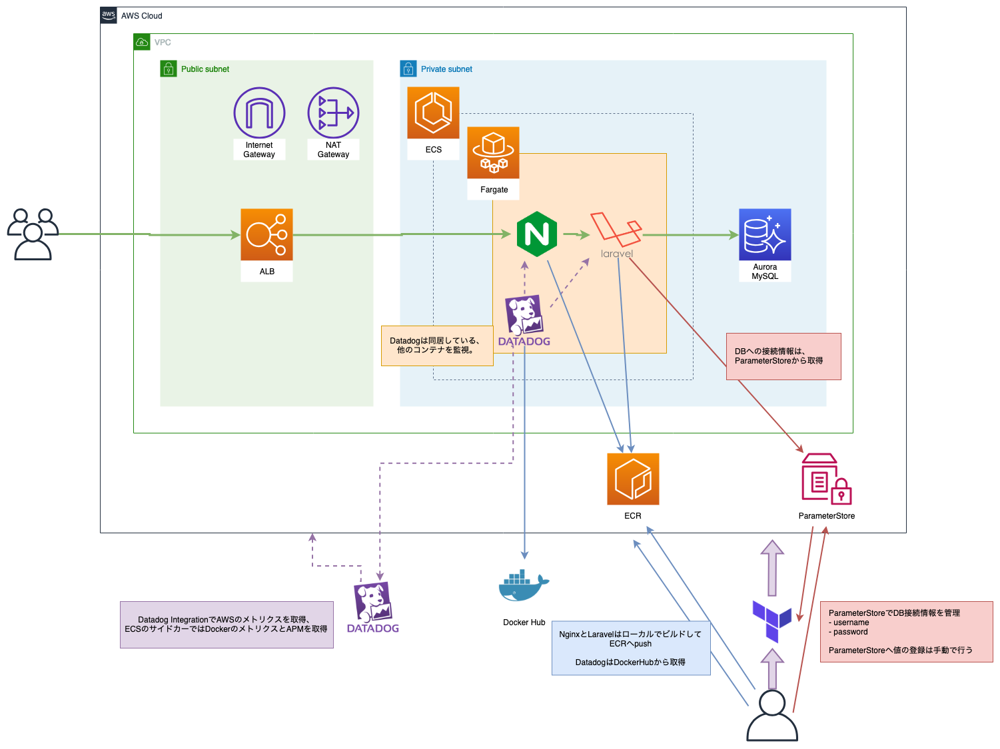
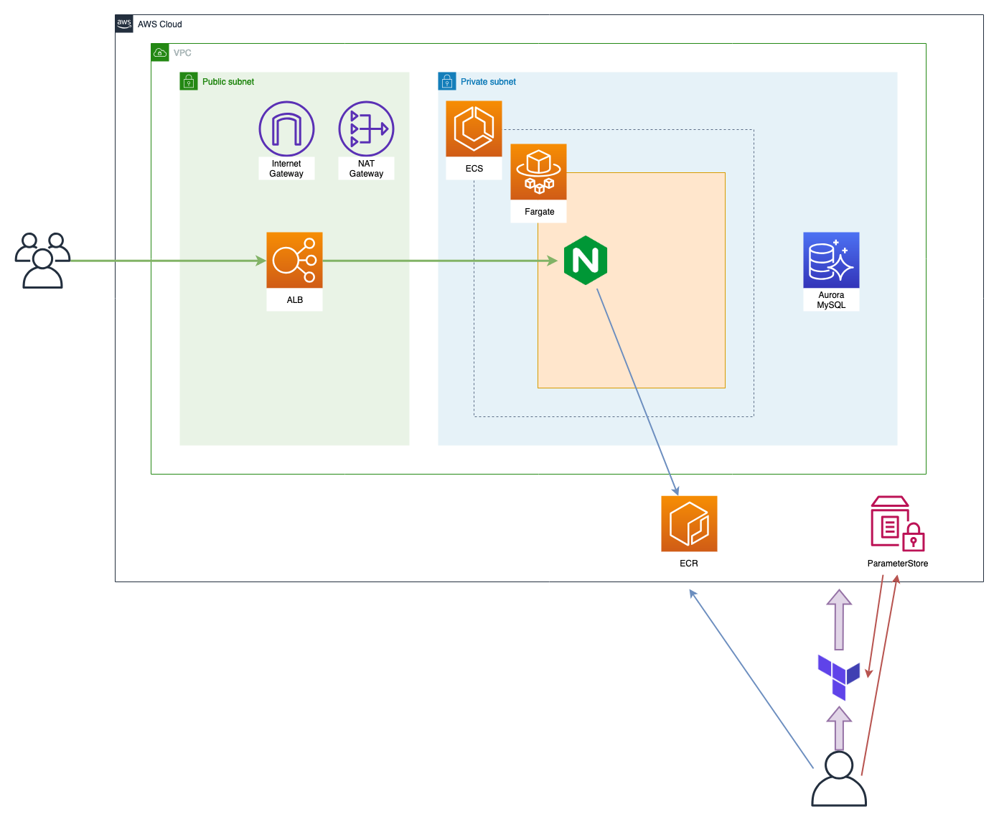
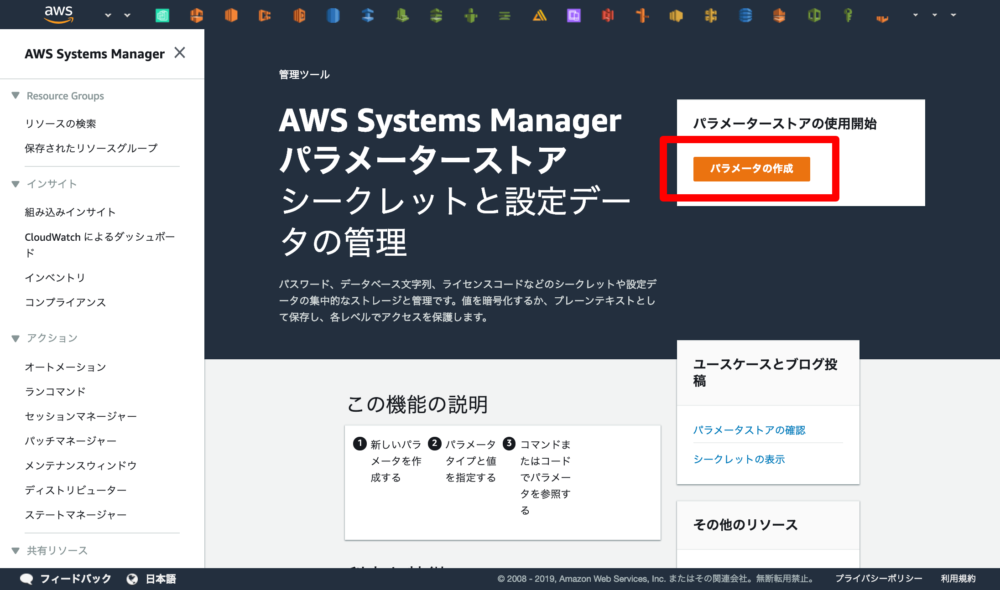
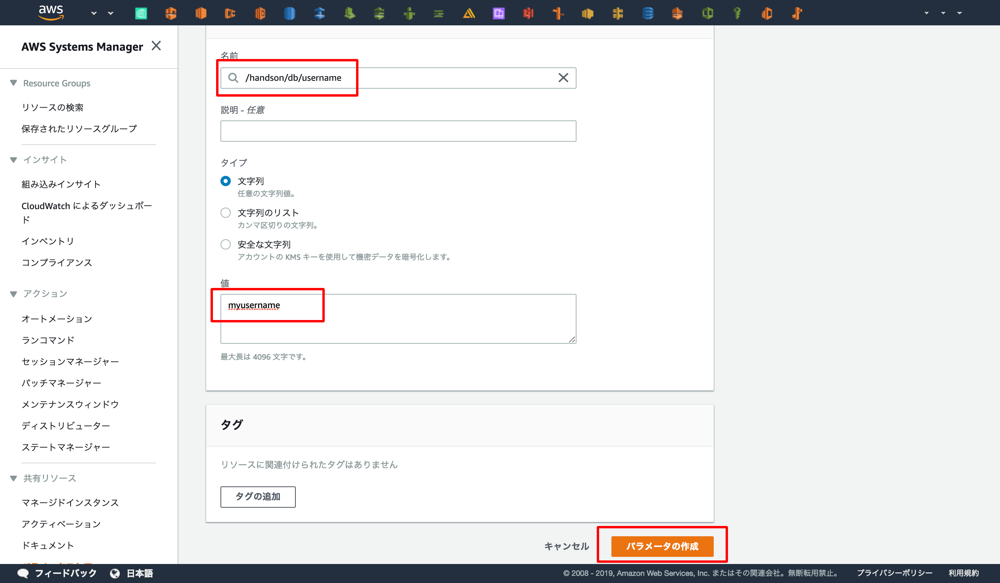
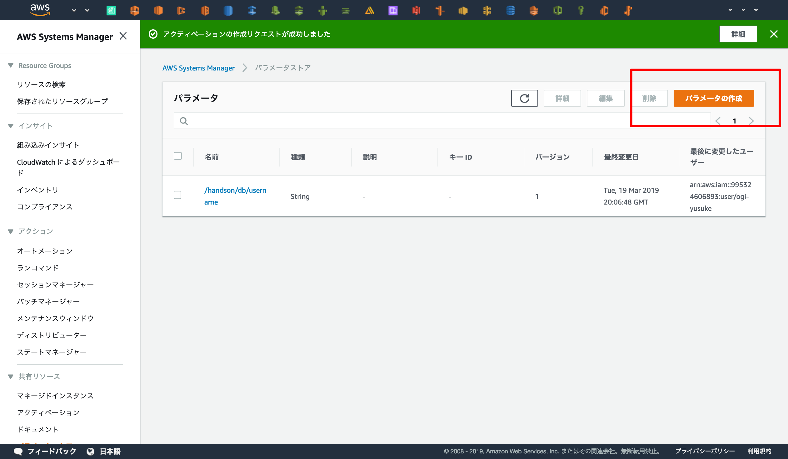
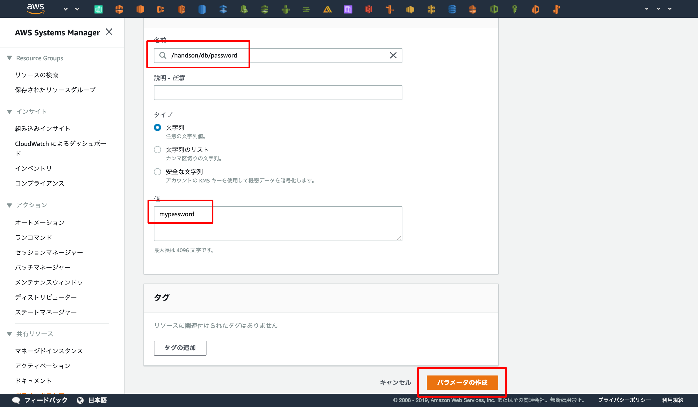
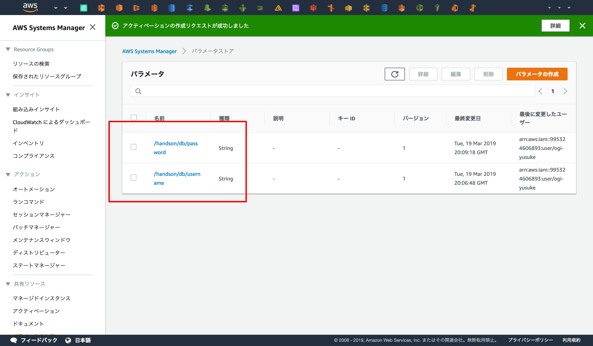
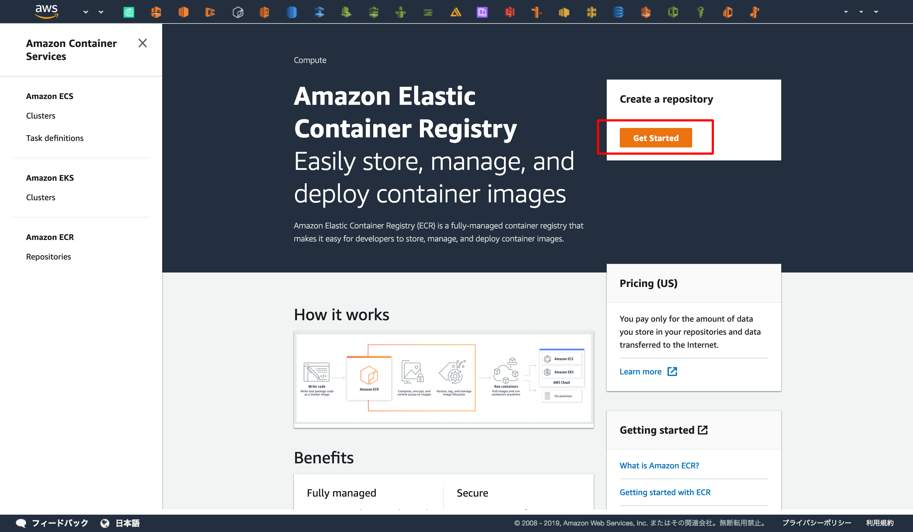
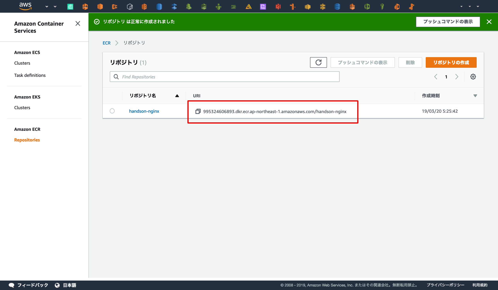
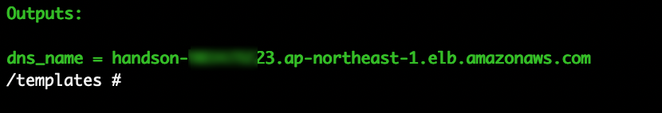

## 作成する環境



AZ・RouteTable・SecurityGroupなどは省略していますが、上記の環境を目標に構築していきます。

## ハンズオン環境の構築



基本的にTerraformで構築しますが、ParameterStoreとECRだけ手動で構築します。  
ParameterStoreはDBのユーザー名/パスワードのデフォルト値を格納したいため、  
ECRはTerraformのプロビジョニング時にECSを同時に動かしたいためです。

## ParameterStore
ParameterStoreはAWSのサービスの1つで、シークレット情報や設定情報を管理するためのサービスです。  
このハンズオンでは **"DBのユーザー名"** と **"DBのパスワード"** をParameterStoreで管理します。  

まずはWebコンソールへ接続してください。  
[AWS Systems Manager - Parameter Store](https://ap-northeast-1.console.aws.amazon.com/systems-manager/parameters?region=ap-northeast-1)


### ユーザー名の登録


まずはユーザー名を登録します。  
名前を `/handson/db/username` で登録し、値は任意の文字列を入力してください  (1 ~ 16文字の英数字を使用する必要があります)。  
ここでは `myusername` とします。





### パスワードの登録

続いてパスワードを登録します。  
名前を `/handson/db/password` で登録し、値は任意の文字列を入力してください (8文字以上の英数字を使用する必要があります)。
ここでは `mypassword` とします。



## 登録情報の確認

最後に `/handson/db/username` と `/handson/db/password` が登録していることを確認してParameterStoreの操作は完了です。  




---

## ハンズオン用リポジトリのclone
ローカルへハンズオン用リポジトリのcloneをします。

```
$ git clone https://github.com/y-ohgi/2019-aws-handson.git
$ cd 2019-aws-handson
```

## ECR

### Registryの作成
まずはECRへアクセスし、「Get Started」からDockerレジストリの作成を開始します

[Amazon ECR](https://ap-northeast-1.console.aws.amazon.com/ecr/get-started?region=ap-northeast-1)


レジストリ名を「 `handson-nginx` 」と入力します。  


レジストリの作成が完了しました！  
ここに表示されているURIはDocker Image をpushするときに必要なので控えておきます。




### Docker Build
DockerのBuildを実行します。  
先程控えたURIを使用してECRへビルドしたDocker Image をpushします。

```
$ export ECR_URI_HANDSON_NGINX=<YOUR ECR REGISTRY URI> # 先程控えたURIを環境変数へ展開します。
$ docker build \
    -t ${ECR_URI_HANDSON_NGINX} \
    -f docker/handson-nginx/Dockerfile \
    docker/handson-nginx
```

dockerを立ち上げてnginxが立ち上がるか確認してみましょう
```
$ docker run -p 8080:80 ${ECR_URI_HANDSON_NGINX}
```

[http://localhost:8080](http://localhost:8080)


### ECRへDockerをpush
AWSへログインし、ECRのアクセス情報を取得します。  

アクセスキーは先ほど作成したterraformのものを流用しましょう。

```
$ aws configure
AWS Access Key ID [None]: <YOUR ACCESS KEY>
AWS Secret Access Key [None]:  <YOUR SECRET KEY>
Default region name [None]: ap-northeast-1
Default output format [None]: json
```

ログイン後、dockerの認証情報を取得します。
WARNINGと表示されますが、無視して問題ありません。  
```
$ $(aws ecr get-login --no-include-email --region ap-northeast-1)
WARNING! Using --password via the CLI is insecure. Use --password-stdin.
Login Succeeded
```

最後に、作成したDocker Image をpushしてECRにアップロードされたことを確認します。
```
$ docker push ${ECR_URI_HANDSON_NGINX}
```

[https://ap-northeast-1.console.aws.amazon.com/ecr/repositories/handson-nginx/?region=ap-northeast-1](https://ap-northeast-1.console.aws.amazon.com/ecr/repositories/handson-nginx/?region=ap-northeast-1)


!!! warning "no basic auth credentials"
    `docker push` 後に"no basic auth credentials"と表示される場合、aws cliでログインしているアカウントが異なっています。  
    現在のdefault profile がどのアカウントのものになっているか確認してから `$` を行います

## Terraformでプロビジョニング


実際に図のAWSの環境を構築していきます。

### Terraformの初期化
Terraform用ディレクトリにチェックアウトし、初期化を行います
```
$ cd terraform
$ ls
main.tf
```

Dockerからterraformを立ち上げます
```
$ docker run \
    -e AWS_ACCESS_KEY_ID=<AWS ACCESS KEY> \
    -e AWS_SECRET_ACCESS_KEY=<AWS SECRET ACCESS KEY> \
    -v $(pwd):/templates \
    -w /templates \
    hashicorp/terraform:0.11.12 bash
$ terraform init
```

### プロビジョニング
どんなリソースが作成されるのか `plan` で確認し、 `apply` でプロビジョニングを実行します。
```
$ terraform plan
$ terraform apply
```

RDSのプロビジョニングに時間がかかるため、15分ほど待ちます。  

### 環境の確認
Terraformのプロビジョニングが完了するとDNSが表示されるのでアクセスして動作確認をしましょう。  

  
