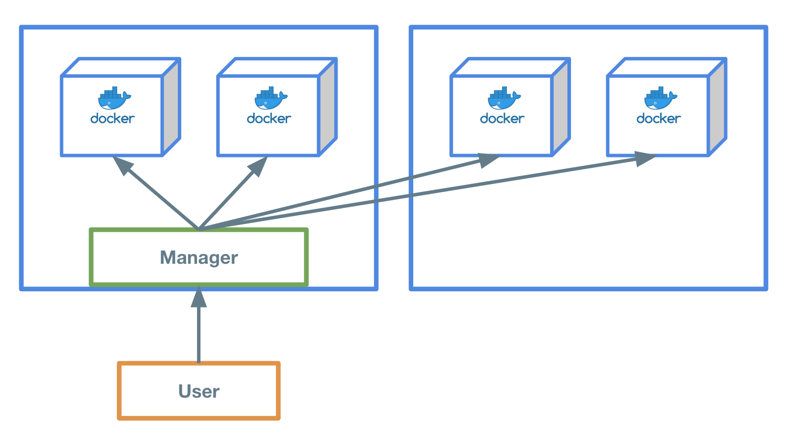
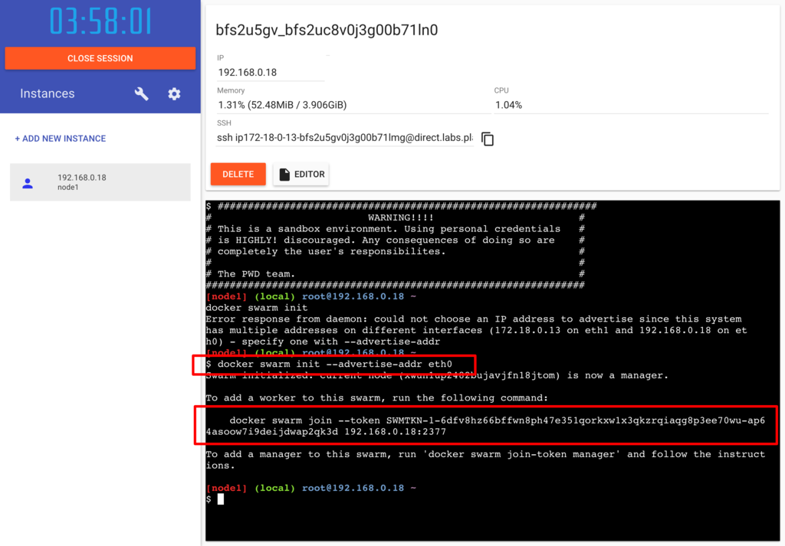
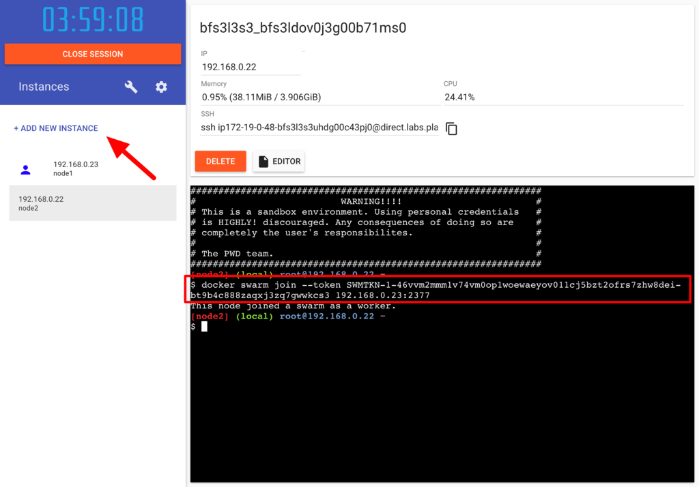
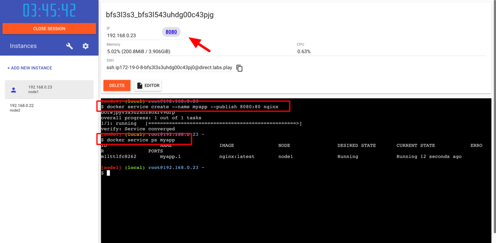
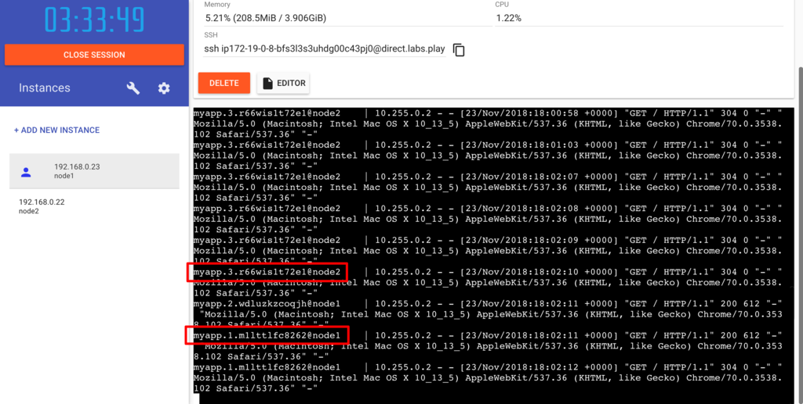

Play with Dockerで上記の図のような構成のSwarmを構築してみましょう。

## Play with Dockerへログイン
まずはWeb上でDockerコマンドを実行することができる環境を手に入れるため、Play with Dockerへログインします。
[https://labs.play-with-docker.com/](https://labs.play-with-docker.com/)

Play with DockerではSwarmを構築するために必要な環境(Netowrkなど)がセットアップされているため、簡単に構築することができます。

## マネージャーを起動


まずは `$ docker swarm init --advertise-addr eth0` でSwarmマネージャーを起動します。
```console
$ docker swarm init --advertise-addr eth0
Swarm initialized: current node (hfvdg1iicbivnh75bex7tb219) is now a manager.

To add a worker to this swarm, run the following command:

    docker swarm join --token SWMTKN-1-0xgun1ud0eb95m34fu7d6fkxu02f5a6soxngk2r7xth3zc6ygo-d9wd80asq1dg7szw7ltjs4zj1 192.168.0.8:2377

To add a manager to this swarm, run 'docker swarm join-token manager' and follow the instructions.
```

`docker swarm join --token <TOKEN> 192.168.0.8:2377` と出力されました。  
これはワーカーノードをマネージャーへ登録させるために必要になるので控えておきましょう。

現在Swarmが管理しているノード(マシンのことをノードと呼びます。)を確認しましょう。  
`$ docker node ls` でSwarmのノードを確認することができます。  
現在はマネージャーのノード1が1台起動されているだけなので、以下のように表示されます。
```console
$ docker node ls
ID                            HOSTNAME            STATUS              AVAILABILITY        MANAGER STATUS      ENGINE VERSION
hfvdg1iicbivnh75bex7tb219 *   node1               Ready               Active              Leader              18.09.4
```

## ワーカーノードを起動


新しいくワーカーノード用のインスタンスを起動します。  

起動したインスタンスをマネージャーへワーカーノードとして登録します。

```console
$ docker swarm join --token SWMTKN-1-0xgun1ud0eb95m34fu7d6fkxu02f5a6soxngk2r7xth3zc6ygo-d9wd80asq1dg7szw7ltjs4zj1 192.168.0.8:2377
This node joined a swarm as a worker.
```

マネージャーとして起動したインスタンスへ戻り、ノードが2台存在することを確認します。  
基本的にユーザーはマネージャーへ命令を行い、マネージャーがその命令を実行します。
```
$ docker node ls
ID                            HOSTNAME            STATUS              AVAILABILITY        MANAGER STATUS      ENGINE VERSION
hfvdg1iicbivnh75bex7tb219 *   node1               Ready               Active              Leader              18.09.4
l9qil0udtt28jowb8bor455nr     node2               Ready               Active                                  18.09.4
```

## Dockerを起動する


"myapp" というサービス名でnginxのDockerイメージを起動してみましょう。

以下のコマンドでマネージャーへnginxを起動するよう指示を出します。
```console
$ docker service create --name myapp --publish 8080:80 nginx
1qso6t53bxkp84p29vwzcmdd4
overall progress: 1 out of 1 tasks
1/1: running   [==================================================>]
```

Play with Dockerのコンソール上へ8080ポートが表示されました。  
実際にアクセスしてnginxが起動していることを確認してみましょう。  

現在起動しているDockerの状態は `docker service ps <サービス名>` で確認することができます。  
"myapp"というサービス内にnginxコンテナが1台起動していることを確認しましょう。
```console
$ docker service ps myapp
ID                  NAME                IMAGE               NODE                DESIRED STATE       CURRENT STATE           ERROR               PORTS
ns7uyza9usea        myapp.1             nginx:latest        node1               Running             Running 6 minutes ago
```

## Dockerコンテナを複数起動する
往々にしてプロダクトの成長とともにサーバー(/コンテナ)は1台だけでは足りなくなってきます。  
Swarmでは簡単に複数台のコンテナを起動することが可能です。

現在は1台のコンテナが1台のノード上に起動されています。これを4台に増やしてみましょう。  
マネージャーで以下のコマンドを実行します。
```console
$ docker service update myapp --replicas 4
myapp
overall progress: 4 out of 4 tasks
1/4: running   [==================================================>]
2/4: running   [==================================================>]
3/4: running   [==================================================>]
4/4: running   [==================================================>]
verify: Service converged
```

コンテナが4台起動されていることを確認しましょう。  
```console
$ docker service ps myapp
ID                  NAME                IMAGE               NODE                DESIRED STATE       CURRENT STATE            ERROR               PORTS
ns7uyza9usea        myapp.1             nginx:latest        node1               Running             Running 13 minutes ago
e16zdn7xs557        myapp.2             nginx:latest        node2               Running             Running 4 minutes ago
4inve40nnh8d        myapp.3             nginx:latest        node2               Running             Running 4 minutes ago
f35de9f7bswd        myapp.4             nginx:latest        node1               Running             Running 4 minutes ago
```

"NODE"カラムを見てみるとnode1とnode2にまたがってコンテナが配置されていることがわかります。

## ログの確認


実際にアクセスが各コンテナへ振り分けられているか、ログを確認してみましょう。

以下のコマンドを実行し、nginxへアクセスを行うことでログが表示されます。  
nginxへアクセスが有ると、行の先頭にコンテナの名前とノードが表示されます。
```console
$ docker service logs -f myapp
myapp.2.e16zdn7xs557@node2    | 10.255.0.2 - ...
myapp.3.4inve40nnh8d@node2    | 2019/04/0 ...
myapp.3.4inve40nnh8d@node2    | 10.255.0.2 ...
  :
```
