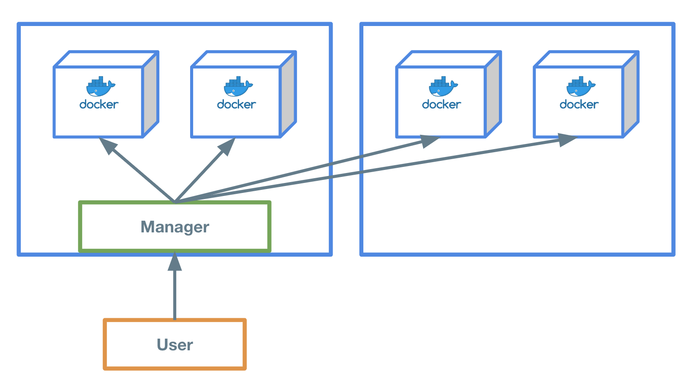

## 概要
SwarmはDocker公式でサポートしているオーケストレーションツールです。  

クラスター構成のアプリケーションを構築したことがない方はPlay with DockerでSwarmを一度触ってみるとオーケストレーションツールのイメージが付きやすくなるため、ECSへを学習する前に触ることをオススメします。

## 構成

Swarmはワーカーノードとマネージャーの2つのコンポーネントで構成されます。

ワーカーノードはコンテナを動かすためのリソースプール(CPU/Memoryなどをリソースと指します。)を提供するための、1つ以上のマシン郡です。  
マネージャーはワーカーノード上へコンテナの配置・管理を行います。  

ユーザーはマネージャーへ命令を行い、ワーカーノードへコンテナを配置します。  
